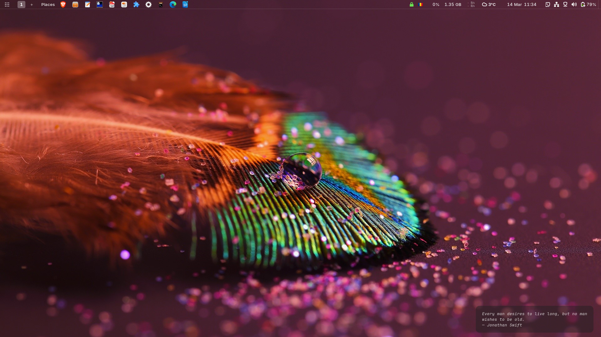
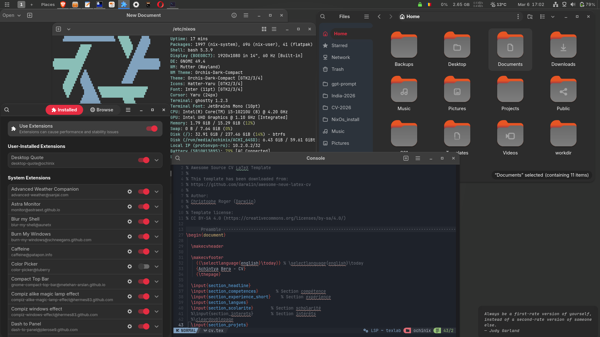

# NixOS Configuration — ThinkPad L14 Gen1

Personal NixOS flake configuration for a Lenovo ThinkPad L14 Gen1 running a pure Wayland GNOME desktop.

> **This config is a full wipe — single OS, entire drive, no dual boot, no Secure Boot.**
> Installation is PXE-only (restricted BIOS, no USB boot option).
>
> Looking for dual boot, Secure Boot, or lanzaboote? See the T480s config instead:
> https://github.com/ochiuom/nixos-config

---




---

## Hardware

| Component | Detail |
|---|---|
| Machine | Lenovo ThinkPad L14 Gen1 |
| CPU | Intel Core i5-10210U (CometLake-U) |
| GPU | Intel UHD Graphics (CometLake-U GT2) |
| RAM | 16GB (~1.2GB used at idle after full boot) |
| Swap | 7.6GB zram (zstd compressed, in-RAM) |
| Storage | 238.5GB NVMe SSD — Toshiba KBG40ZNT256G (LUKS2 encrypted, btrfs) |
| Bluetooth | Intel — disabled on boot |

---

## Disk Layout

```
nvme0n1 (238.5GB NVMe — Toshiba KBG40ZNT256G)
├─ nvme0n1p1     1GB      /boot (EFI — systemd-boot)
└─ nvme0n1p2   237.5GB   LUKS2 encrypted
   └─ cryptroot (btrfs subvolumes)
      ├─ @              /
      ├─ @home          /home
      ├─ @nix           /nix
      ├─ @snapshots     /.snapshots
      ├─ @var-log       /var/log
      └─ @tmp           /tmp

zram0   7.6GB   Compressed swap (zstd, 50% RAM)
```

---

## Features

**Boot & Security**
- systemd-boot (no Secure Boot — restricted BIOS)
- Full disk encryption with LUKS2
- btrfs with zstd compression across all subvolumes
- sudo-rs (memory-safe Rust replacement for sudo)
- AppArmor with upstream profiles and kill-unconfined enabled
- USBGuard with device whitelist — blocks unknown USB devices
- Kernel module blacklist (amateur radio, obsolete filesystems, obscure protocols)
- Full sysctl hardening (kptr, dmesg, ptrace, network stack, filesystem protections)
- Core dumps disabled system-wide
- DNS over TLS via systemd-resolved (Cloudflare malware-blocking `1.1.1.2`)
- GNOME privacy lockdown (USB protection, no lock screen notifications, location disabled)
- nftables firewall
- fail2ban with incremental bans
- firejail sandboxing for mpv and audacious
- SSH key-only authentication with hardened ciphers and MACs

**Power Management**
- TLP with per-state CPU governor (performance on AC, powersave on battery)
- thermald for thermal management
- throttled for Intel CometLake-U power limit tuning
- irqbalance for multi-core IRQ distribution
- S3 deep sleep (`mem_sleep_default=deep`)
- Battery charge thresholds (70–80%) for long-term health
- zram swap with zstd compression

**Desktop**
- Pure Wayland GNOME
- GDM display manager
- Declarative GNOME extension settings (dash-to-panel, blur-my-shell, astra-monitor, space-bar, and more)
- Flatpak + Flathub
- PipeWire audio with WirePlumber
- Intel VA-API hardware video acceleration (intel-media-driver)
- Plymouth boot splash

**Networking**
- DNS over TLS with malware/phishing blocking (Cloudflare `1.1.1.2`)
- WireGuard VPN via NetworkManager (ProtonVPN)
- Syncthing for file sync
- Tor client (SOCKS5 proxy for Thunderbird)

---

## Structure

```
/etc/nixos/
├── flake.nix                        # Inputs: nixpkgs, home-manager, disko
├── flake.lock
├── configuration.nix                # Entry point, imports all modules
├── hardware-configuration.nix       # Auto-generated from nixos-generate-config
├── disko_1os.nix                    # Declarative disk layout (LUKS2 + btrfs + EFI)
├── home.nix                         # Home Manager configuration
├── POST_INSTALL.md                  # Post-install manual steps
├── TROUBLESHOOT.md                  # Chroot recovery and rescue procedures
└── modules/
    ├── boot.nix                     # systemd-boot, kernel, Plymouth, kernel params
    ├── hardware.nix                 # Intel iGPU, firmware, bluetooth, btrfs, zram
    ├── networking.nix               # Hostname, firewall, SSH, fail2ban
    ├── desktop.nix                  # GNOME, GDM, Flatpak, fonts, PipeWire
    ├── power.nix                    # TLP, thermald, throttled, irqbalance, sysctls
    ├── security.nix                 # sudo-rs, AppArmor, USBGuard, firejail, sysctl hardening, DNS
    ├── packages.nix                 # System packages
    ├── services.nix                 # Syncthing, Tor, Nix settings, GC
    └── home/
        ├── desktop-quote/           # Custom GNOME Shell extension (daily quote widget)
        └── gnome-extensions.nix     # Declarative dconf settings for all GNOME extensions
```

---

## Installation

> **Full drive wipe. No dual boot. No Secure Boot.**
> This machine cannot boot from USB — PXE boot via a self-hosted netboot.xyz server is the only method.

### What you need

- Raspberry Pi 5 running as a netboot.xyz PXE server on the same local network
- `pxe.conf` from this repo loaded on the Pi
- Android phone with Termux (or any SSH client) to control the Pi if you have no monitor for it

---

### Step 1 — Start the PXE server on the Pi 5

From Termux on your Android phone (or any terminal with SSH access to the Pi):

```bash
ssh pi@<pi5-ip>
sudo dnsmasq -C pxe.conf -d
```

Leave this running. dnsmasq will now respond to PXE boot requests on the network.

---

### Step 2 — Enable PXE boot on the L14

Power on the laptop and enter BIOS (`F1` on ThinkPad boot).

Go to **Startup → Boot** and check if a network/PXE boot entry exists. If not:

1. Go to **Network** settings in BIOS
2. Enable **PXE Boot** (may be listed as "Network Boot" or "IPv4/IPv6 Network Stack")
3. Save and exit BIOS

---

### Step 3 — PXE boot into NixOS live environment

Reboot the laptop. Select the network boot entry from the boot menu (`F12` on ThinkPad).

The laptop will get a DHCP lease from dnsmasq on the Pi and load the netboot.xyz menu. Select the NixOS live environment.

Once booted into the NixOS live shell:

```bash
nix-shell -p git
git clone https://github.com/ochiuom/nixos-config-1os
cd nixos-config-1os
```

---

### Step 4 — Verify disk target

> **This will wipe the entire drive.** Double check before running anything.

```bash
lsblk
ls -l /dev/disk/by-id/ | grep TOSHIBA
# Expected: nvme-KBG40ZNT256G_TOSHIBA_MEMORY_90SPCCRXQA81
# Confirm this matches disko_1os.nix before proceeding
```

---

### Step 5 — Format and mount

```bash
sudo wipefs -a /dev/nvme0n1
lsblk

sudo nix --extra-experimental-features "nix-command flakes" \
  run github:nix-community/disko -- --mode format,mount ./disko_1os.nix
```

---

### Step 6 — Install

```bash
sudo nix --extra-experimental-features "nix-command flakes" \
  run nixpkgs#nixos-install -- --flake .#ochinix-pc
```

When prompted, set the **root password**.

---

### Step 7 — Reboot

```bash
reboot
```

- Default user password: `changeme` — **change it immediately after login**
- No BIOS changes needed after reboot — Secure Boot is not in use

Proceed to [POST_INSTALL.md](./POST_INSTALL.md) for the rest of the setup.

---

## Key Commands

Aliases defined in `home.nix`:

```bash
nos       # Rebuild and switch (via nh — recommended)
nrs       # Rebuild and switch (via nixos-rebuild directly)
update    # Update flake inputs + rebuild
upgrade   # Update flake inputs + rebuild + garbage collect
ngc       # Garbage collect (keep last 3 generations)
UP        # Full system upgrade (flake + rebuild + flatpak + firmware + gc)
unlockv   # Unlock encrypted vault
lockv     # Lock vault
backupv   # Rsync encrypted vault to ~/Backups
```

---

## Adding a Package

One-time setup (run once as normal user):

```bash
sudo chown -R ochinix:users /etc/nixos
```

Daily workflow:

```bash
cd /etc/nixos
# Edit the relevant .nix file e.g. modules/packages.nix
git add .
git commit -m "add: packagename"
nos
```

---

## Heavy Packages

Some packages are expensive to build and are commented out by default.

### RustDesk

Compiles from source (Rust + Flutter):
- ~100% CPU for the entire build
- ~9GB RAM during compilation
- ~10–15 minutes build time

```nix
# Uncomment only when needed
# rustdesk
```

### PDFStudio Viewer

Downloads from an external server during install which can stall due to server availability.

```nix
# Uncomment only when needed
# pdfstudioviewer
```

Subsequent rebuilds after either package is cached are instant.

---

## Post Installation

See [POST_INSTALL.md](POST_INSTALL.md) for complete post-installation setup including USBGuard policy generation, ProtonVPN DNS fix, Tor, Neovim, SageMath, organize-tool, and Flatpak apps.

---

## Troubleshooting

See [TROUBLESHOOT.md](TROUBLESHOOT.md) for chroot recovery, password reset, and other system rescue procedures.

---

## References

- EasyEffects presets: https://github.com/wwmm/easyeffects/wiki/Community-presets
- Orchis GTK theme: https://www.gnome-look.org/p/1357889
- Hatteru Yaru icon theme: https://www.gnome-look.org/p/2146096
- NvChad: https://nvchad.com/docs/quickstart/install/
- netboot.xyz: https://netboot.xyz/docs/

---

## License

Personal configuration, use freely as reference.
